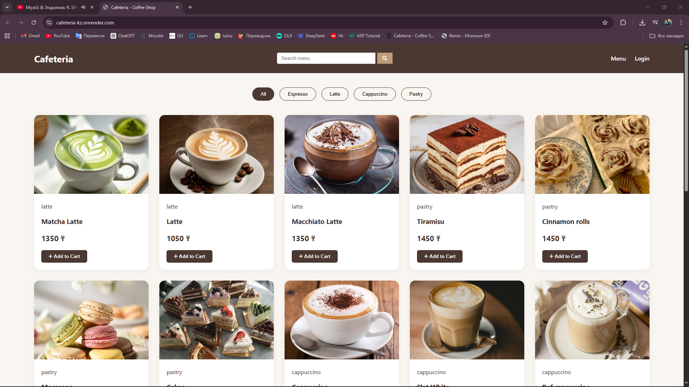
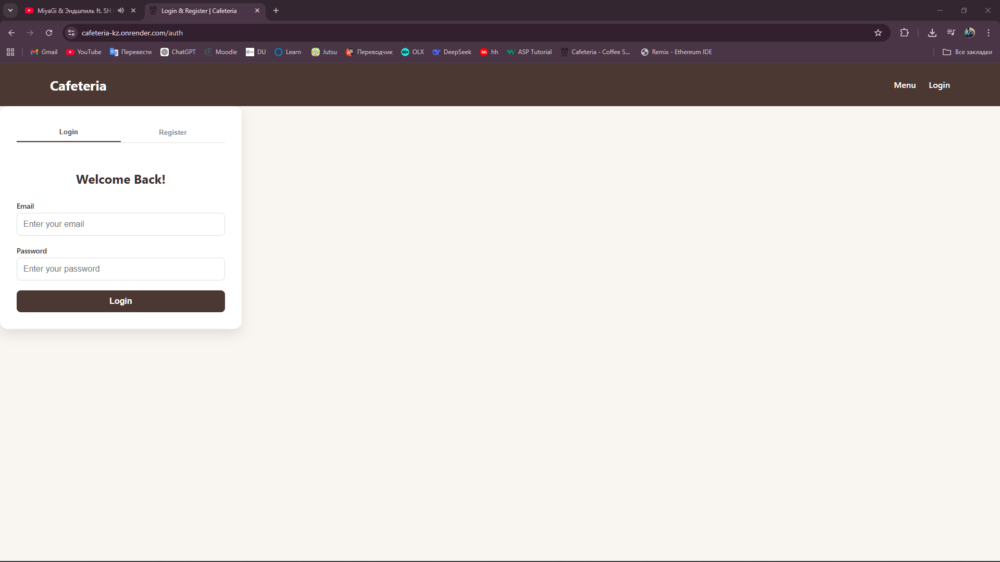
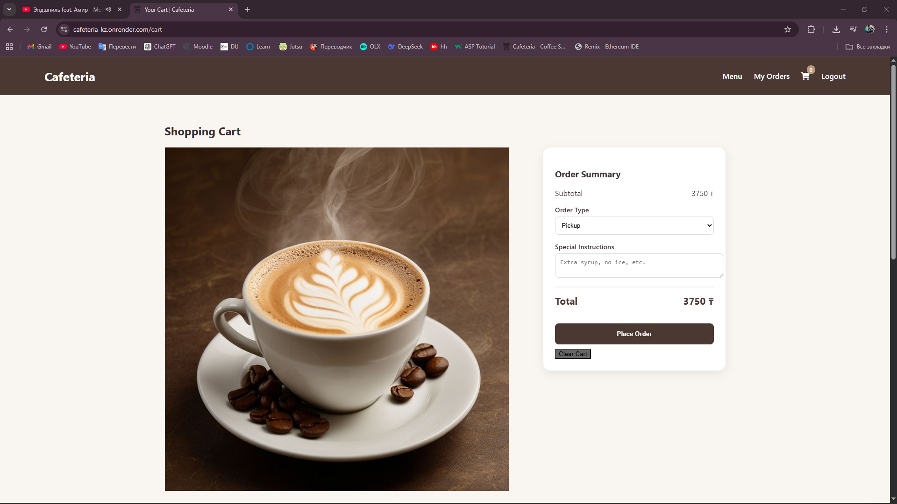
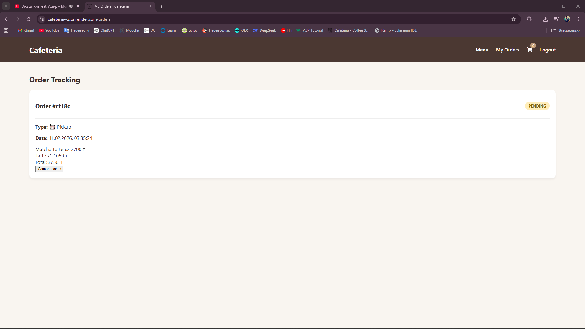
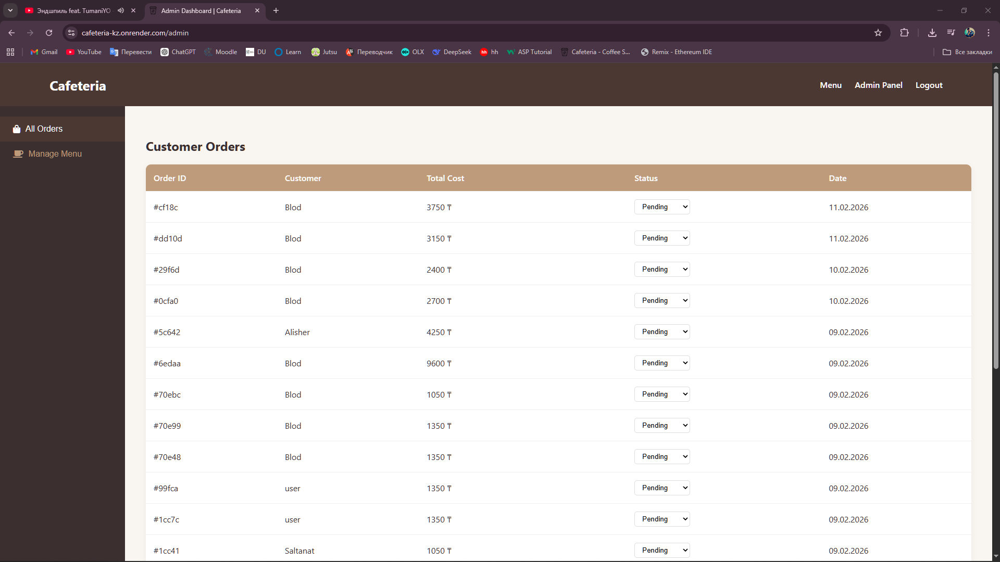

# Cafeteria.kz

Cafeteria.kz is a full-stack web application for online food ordering.
Users can browse products, add them to a cart, place orders, and view order history.
Administrators can manage products, users, and order statuses.

The backend is built with Node.js, Express, and MongoDB Atlas, and includes authentication,
authorization, validation, and email notifications.

---

## Project Overview

The application provides the following features:

- User registration and login
- JWT-based authentication
- Role-Based Access Control (User / Admin)
- Product catalog management
- Shopping cart functionality
- Order creation and order history
- Admin panel for managing users and orders
- Welcome email sent after registration using SMTP
- Responsive user interface for desktop and mobile devices

---

## Tech Stack

### Backend
- Node.js
- Express.js
- MongoDB Atlas
- Mongoose
- JSON Web Token (JWT)
- bcrypt
- Nodemailer (SendGrid SMTP)

### Frontend
- HTML
- CSS
- JavaScript

---

## Setup Instructions

### 1. Clone the repository
```bash
git clone https://github.com/Saltanat4/cafeteria.kz.git
cd cafeteria.kz
```

### 2. Install dependencies
```bash
npm install
```
The project uses MongoDB Atlas as a cloud database (local MongoDB is not used).

### 3. Environment variables
Create a `.env` file in the root directory:

```env
PORT=5000
MONGO_URI=your_mongodb_atlas_connection_string

JWT_SECRET=your_jwt_secret
JWT_EXPIRES_IN=7d

SMTP_HOST=smtp.sendgrid.net
SMTP_PORT=587
SMTP_USER=apikey
SMTP_PASS=your_sendgrid_api_key
MAIL_FROM=your_verified_sender_email
```

Sensitive information is stored in environment variables and is not committed to the repository.

---

### 4. Run the project
```bash
npm run dev
```

The server will start at:
```
http://localhost:5000
```

---

## API Documentation

### Authentication (Public)
| Method | Endpoint | Description |
|------|---------|-------------|
| POST | `/api/auth/register` | Register a new user |
| POST | `/api/auth/login` | Login and receive JWT token |

---

### User Management (Private)
| Method | Endpoint | Description |
|------|---------|-------------|
| GET | `/api/users/me` | Retrieve logged-in user profile |
| PUT | `/api/users/me` | Update user profile |

---

### Products
| Method | Endpoint | Description |
|------|---------|-------------|
| GET | `/api/products` | Get all products |
| GET | `/api/products/:id` | Get product by ID |
| POST | `/api/products` | Create a product (Admin only) |
| PUT | `/api/products/:id` | Update a product (Admin only) |
| DELETE | `/api/products/:id` | Delete a product (Admin only) |

---

### Cart (Private)
| Method | Endpoint | Description |
|------|---------|-------------|
| GET | `/api/cart` | Get cart items |
| POST | `/api/cart` | Add item to cart |
| PUT | `/api/cart/:id` | Update item quantity |
| DELETE | `/api/cart/:id` | Remove item from cart |
| DELETE | `/api/cart` | Clear cart |

---

### Orders (Private)
| Method | Endpoint | Description |
|------|---------|-------------|
| GET | `/api/orders` | Get user orders |
| GET | `/api/orders/:id` | Get order by ID |
| GET | `/api/orders/:id/items` | Get order items |
| POST | `/api/orders` | Create a new order |
| PUT | `/api/orders/:id` | Update order |

---

### Admin (Admin only)
| Method | Endpoint | Description |
|------|---------|-------------|
| GET | `/api/admin/orders` | Get all orders |
| GET | `/api/admin/users` | Get all users |
| PUT | `/api/admin/orders/:id/status` | Update order status |

---

## Authentication & Security

- Passwords are hashed using bcrypt
- JWT is used for secure authentication
- Protected routes use middleware to verify tokens
- Role-Based Access Control (RBAC) is implemented
- Sensitive keys are stored in environment variables

---

## SMTP Email Service

After successful registration, the system sends a welcome email to the user.

- Email service provider: SendGrid
- Email library: Nodemailer
- Authentication via API Key
- No personal email account credentials are used
- SMTP credentials are stored in environment variables

---

## Screenshots

### Home Page

Home page displaying available products.

### Authentication Page

Authentication page with login and registration forms.

### Cart Page

Shopping cart with selected products and quantity controls.

### Orders Page

User order history with order status tracking.

### Admin Panel

Admin panel for managing orders and users.

---

## Deployment

The project is deployed using a cloud platform such as Render or Railway.

Live URL:

# [Cafeteria.kz](https://cafeteria-kz.onrender.com)

---


## Conclusion

Cafeteria.kz demonstrates a complete web application with authentication, authorization,
database integration, validation, role-based access control, and SMTP email integration,
following modern backend development best practices.
